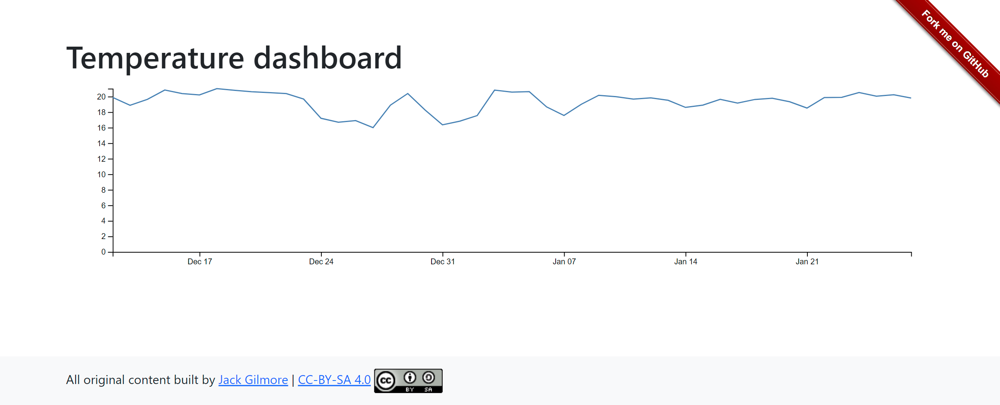

# Temperature Dashboard

## About the project



A proof of concept application built for [State of Open Con® 24](https://stateofopencon.com/) to demonstrate extracting data from on-premise using GitHub Actions to display on a remote cloud platform.

### Built with
- Data pipeline
    - [Python 3](https://www.python.org/)
    - [Git](https://git-scm.com/)
    - [Home Assistant (Data provider)](https://www.home-assistant.io/)
- Front end
    - [Jekyll (static site generator)](https://jekyllrb.com/)
    - [GitHub Pages (hosting)](https://pages.github.com/)
    - [Bootstrap 5 (UI)](https://getbootstrap.com/)
    - [D3.js (Visualisation)](https://d3js.org/)

## Getting started
To get a local copy up and running, follow these steps:

### Data pipeline

Scripting for the data pipeline is stored within the `script` folder

#### Prerequisites

You should have the following installed:
- [Python 3](https://www.python.org/) (3.9 was used during development)
- [pip](https://pypi.org/project/pip/)

For the purposes of this demo, a Home Assistant instance was used with a temperature sensor for recording data. If you do not have this, you can replace the `main.py` script with your own script to produce data, as long as it saves to the `\site\_data` folder as temperature.csv if you wish to use the front-end as is.

Make sure you run `pip install -r requirements.txt` first.

If using Home Assistant, you will need to generate a long-lived access token using the following instructions for auth: https://developers.home-assistant.io/docs/auth_api/#long-lived-access-token. Then substitute it in to the script usage below where `HOME_ASSISTANT_TOKEN` is. You may wish you pass this in an environment variable for security.

#### Script usage

```shell

python .\main.py URL_TO_HOME_ASSISTANT SENSOR_ENTITY_ID HOME_ASSISTANT_TOKEN

```

For example:

```shell

python .\main.py https://ha.gnet.ovh sensor.office_temperature_sensor_temperature  $Env:HA_TOKEN

```

By default, the script will pull data from the previous day. If you wish to choose a different day, pass the date in `YYYY-MM-DD` format like the below example:

```shell

python .\main.py https://ha.gnet.ovh sensor.office_temperature_sensor_temperature  $Env:HA_TOKEN --date 2024-01-31

```

### Front end

The front end site is stored within the `site` folder

#### Prerequisites

You should have the following installed: 
- [Ruby 2.5.0 or higher](https://www.ruby-lang.org/en/)
- [Jekyll and bundler](https://jekyllrb.com/docs/)

Once you have these installed, run a terminal from the `/site/` directory and run the following command to install dependencies:

```shell

bundle install && bundle update

```

#### Usage

To run the site locally, run the following command from within the `/site/` directory:

```shell

bundle exec jekyll serve

```

After the site builds you should see output similar to this:

```shell
Configuration file: C:/Users/Jack/source/repos/JackGilmore/TemperatureDashboard/site/_config.yml
            Source: C:/Users/Jack/source/repos/JackGilmore/TemperatureDashboard/site
       Destination: C:/Users/Jack/source/repos/JackGilmore/TemperatureDashboard/site/_site
 Incremental build: disabled. Enable with --incremental
      Generating...
                    done in 0.094 seconds.
  Please add the following to your Gemfile to avoid polling for changes:
    gem 'wdm', '>= 0.1.0' if Gem.win_platform?
 Auto-regeneration: enabled for 'C:/Users/Jack/source/repos/JackGilmore/TemperatureDashboard/site'
    Server address: http://127.0.0.1:4000/TemperatureDashboard/
  Server running... press ctrl-c to stop.
```

Your site should then be available from the server address which is usually `http://127.0.0.1:4000/TemperatureDashboard/`.